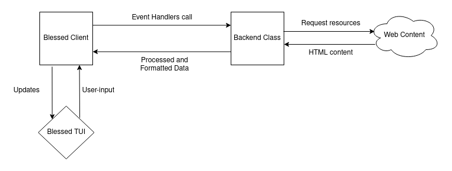

# Project Description

A simple text-mode terminal browser, written in TypeScript.

# Scope

This project is a basic implementation of a text-mode browser in the terminal. The browser will have basic abilities such as scrolling, clicking links, and parsing simple text formatting like bolded and italicized text. Complex features, such as parsing CSS and JS, are outside the scope of this project.

# Platform Selection and Tech Stack

## Platform:

Terminal: the project will display a graphical user interface on the terminal, as per the requirements

[**Node.js**](https://nodejs.org/en/): a JavaScript runtime for the desktop, we choose this because it is well-maintained and everyone on the team has experience using it.

## Container:

[**Docker**](https://www.docker.com/): since Docker is a microenvironment to deploy applications without running a virtual machine like Vagrant, Docker takes less time to launch.

## Languages:

[**TypeScript**](https://www.typescriptlang.org/): we choose TypeScript because its type definitions are very useful during development, and everyone on the team had experience working with TypeScript. Risks: our code must be converted to JavaScript to fit the publication of the open source book, so we must find a tool that can accurately remove type definitions.

**JavaScript**: although all of our team members are all experienced with JavaScript, we did not choose JavaScript due to the lack of type definition. The lack of type definition causes our code to be prone to bugs, and increases development difficulty as the IDE cannot make accurate code suggestions compared to TypeScript.

## Terminal front-end library:

[**Blessed**](https://github.com/chjj/blessed): this front-end library is well-developed and has good documentation. Additionally, Blessed's widget API is reminiscent of a DOM. All our team members have experience with React and HTML, so this familiarity may increase the speed of development. Risks: currently there is no mouse or resize event support on Windows. The repository also seems to be abandoned by its creator, so it may be impossible to receive security patches or bug fixes in the future.

[**Ncurses**](https://github.com/mscdex/node-ncurses): a JavaScript implementation of curses. However, we are not using it because it is no longer actively maintained, and its README file suggests newcomers to use the Blessed library.

[**Terminal-Kit**](https://github.com/cronvel/terminal-kit): this is an alternative to Blessed and Ncurses, as it is much newer and active in development. However, we did not choose this library because it is severely lacking documentation. We would need to understand the source code to be able to use certain core features for our project (e.g. form buttons).

## HTTP client library:

[**Axios**](https://github.com/axios/axios): a simple library for sending HTTP requests. We chose this library due to its simplicity and its wide range of support for different JavaScript versions.

[**Node-Fetch**](https://github.com/node-fetch/node-fetch): a lightweight implementation of the browsers\' window.fetch API for Node. However, it is not supported on older JavaScript versions, and it is a little more complicated to use compared to Axios.

## HTML parsing library:

[**Cheerio**](https://github.com/cheeriojs/cheerio): library to parse HTML string into a tree structure. Its syntax is similar to jQuery, which will speed up development as the team is familiar with jQuery.

## Testing tools:

[**Mocha**](https://github.com/mochajs/mocha): a JavaScript framework for asynchronous testing. We chose Mocha over [**Jest**](https://github.com/facebook/jest) because we will mainly be testing our backend tree parsing and Mocha was initially built to support the Node.js testing process. One of the downsides of Mocha is that it requires installing other testing libraries like chai (an assertion library) to function well.

[**FS**](https://nodejs.org/api/fs.html): a file-system tool built into Node.js that allows us to easily read files. This will be used to directly read HTML files.

[**Apache**](https://hub.docker.com/_/httpd/): a web server to host simple HTML files for testing.

# Repository Design

**Main**: this branch will always contain tested and working code

**Milestone-\[1-4\]**: these branches will contain development code for each milestone, it is not guaranteed to be stable, but it will be thoroughly tested before merging into **Main**

**Feature**: these branches will contain development code for each feature, the new feature will be tested before merging into its respective **Milestone** branch

# Architecture Design

We will use an event-driven architecture for this project, since the Blessed library allows us to register listeners for user input such as keyboard and mouse events. Additionally, we will define a class that makes HTTP requests at the request of the Blessed client. This class will also be responsible for parsing, processing, and formatting the provided HTML document that will be returned to our Blessed client for rendering.

# Preliminary Roadmap

1.  Setup

    a. \[Andi, Yichen\] Write NPM configuration (install Axios, Blessed, Cheerio, Mocha)

    b. \[Yichen\] Setup TypeScript configuration files

    c. \[Andi\] Setup Mocha and simple auto passing test that displays \"I\'m running a test!\"

    d. \[Nicki\] Configure Docker environment

    e. \[Myles\] Setup barebones Bless terminal UI that displays \"I am running!\"

2.  Backend Processing Class

    a. \[Myles\] Setup simple dummy HTTP server to serve test pages and create some sample html pages.

    b. \[Andi\] Get URL from a command line argument

    c. \[Andi\] Fetch HTML data from URL using Node-Fetch

    d. \[Myles\] Fetch HTML data from local file system using FS

    e. \[Andi\] Process HTML data into a hierarchical structure using Cheerio

    f. \[Yichen\] Traverse hierarchical structure and extract only text content from tags, ignoring the hierarchical structure of data

    g. \[Yichen\] Write tests for parsing functions

    h. \[Nicki\] Dump extracted HTML text into the Blessed window

3.  Terminal User Interface Client Class

    a. \[Myles, Yichen\] Add functionality to backend processing class to format hierarchical structure based on their HTML tags

    b. \[Myles, Yichen\] Write tests for the updated backend functionality

    c. \[Andi\] Update the Blessed client to accept URLs from the command line argument, instead of the Parser class accepting the URLs from the command line argument

    d. \[Nicki\] Implement page scrolling for pages that are longer than the height of the terminal window. This will require the setup of keyboard and mouse event listeners because the client should be able to move the page with either the up and down arrows or the scroll wheel on the mouse

4.  Polish Browser Features

    a. \[Nicki\] Display a help menu for keyboard shortcuts

    b. \[Andi\] Keyboard shortcut to get user input to visit a new URL

    c. \[Myles, Yichen\] Add support for clickable link

    d. \[Anyone\] Save browsing history to visit the previous page or next page via keyboard shortcuts (Possible feature)

    e. \[Anyone\] Create and visit multiple tabs in the browser via keyboard shortcuts (Possible feature)

# Next Steps

Myles:

- Install Blessed packages and read its documentation

- Create a Blessed terminal user interface that displays \"I am running!\"

Andi:

- Install Mocha dependencies and modify NPM configuration

- Setup simple mocha test and npm test script

Yichen:

- Install packages for TypeScript development

- Setup TypeScript configuration

Nicki:

- Configure Docker environment

- Document commands to build and run Docker environment
